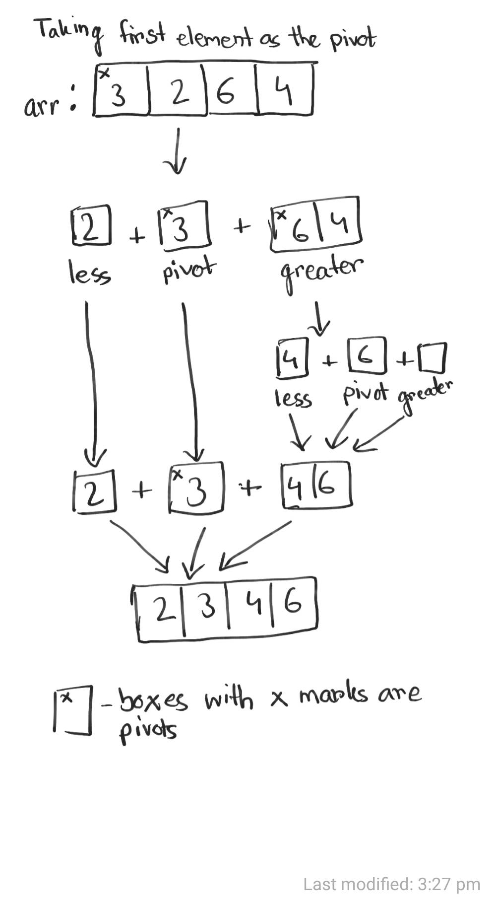

## Quicksort
Quicksort is a popular sorting algorithm based on the "divide and conquer" strategy. It has a time complexity of **O(nlog(n))**.

Before moving on to how quicksort works, lets first try to understand when we need to sort an array and when not to. Consider the following cases: 
1. We have an array with 0 elements: {}. Do we need to sort it anymore? No. There's nothing to sort.
2. We have an array with 1 element: {4}. Do we need to sort it anymore? No. An array of 1 element is already a sorted array.
3. We have an array with 2 or more elements: {4, 2, ...}. Do we need to sort it anymore? Yes. We need to sort an array with 2 or more elements.

So, for the first two cases, we can write:


```python
def quicksort(arr):
    if len(arr) < 2:
        return arr
```

Lets test the two initial conditions:


```python
print(quicksort([]))
print(quicksort([54]))
```

    []
    [54]


It works properly. Now, we're ready to see how quicksort utilises this simple concept to sort a big array.

Given an array *arr*, you have to choose a *pivot*. After choosing the *pivot*, divide the array into 3 parts: **less = {array with elements less than *pivot*}**, the **pivot** and **greater = {array with elements greater than *pivot*}**. Then, apply *quicksort* (recursively) on **less** and **greater** arrays and join **less** + **pivot** + **greater** into a single array.



**Pseudocode for quicksort**
    0. FUNCTION quicksort(arr):
    1. arr: array of elements
    2. IF arr.length <= 1 (0 or 1 element) THEN
        3. return arr (array of 0 or 1 element is already sorted)
    4. ELSE
        5. pivot = arr[0] (choose first element as pivot, there are better ways to choose a pivot)
        6. less = {array with elements less than *pivot*}
        7. greater = {array with elements greater than *pivot*}
        8. return quicksort(less) + [pivot] + quicksort(greater)


```python
def quicksort(arr):
    if len(arr) < 2:
        return arr
    
    pivot = arr[0]
    
    # see explanation below, if you don't understand these two lines
    # less - array with elements less than *pivot*
    less = [i for i in arr[1:] if i <= pivot] 
    # greater - array with elements greater than *pivot*
    greater = [i for i in arr[1:] if i > pivot]
    
    return quicksort(less) + [pivot] + quicksort(greater)
```


```python
A = [4, 2, 5, 1, 9, -3, 0, 7]
print( quicksort(A) )
```

    [-3, 0, 1, 2, 4, 5, 7, 9]


At line 5, we chose the first element of the array as the pivot. Generally, this isn't a good practice. (Figure out why. Hint: The array may already be sorted). We can choose a random element in the array as a pivot, or the mid point of the array.


```python
arr = [5, 3, 9, 2, 1]

# choose a random pivot
from random import randint
random_point = randint(0, len(arr)-1)
pivot = arr[random_point]
print("Random pivot: %d" % pivot)

# OR choose midpoint as the pivot
mid_point = len(arr) // 2
pivot = arr[mid_point]
print("Midpoint pivot: %d" % pivot)
```

    Random pivot: 2
    Midpoint pivot: 9


If you're unfamiliar with the syntax on line 9 and 11, this syntax is known as [list comprehension](http://www.secnetix.de/olli/Python/list_comprehensions.hawk). Here's how it translates to a normal loop:


```python
# this line is the same as code below
x = [i for i in range(0, 10) if i > 5]

my_list = []
for i in range(0, 10):
    if i > 5:
        my_list.append(i) # add to my_list array/list


print( x )
print( my_list )
```

    [6, 7, 8, 9]
    [6, 7, 8, 9]

