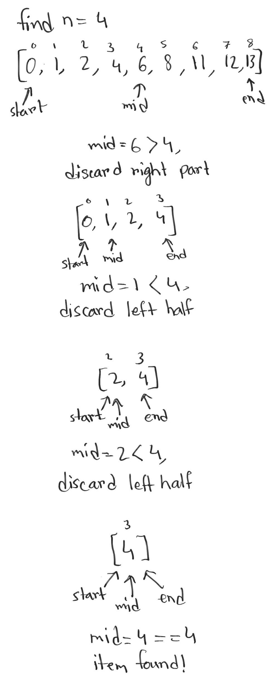
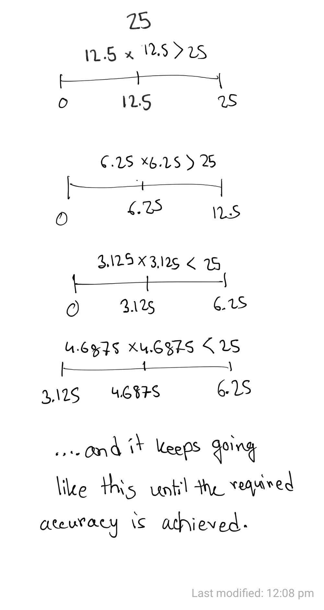

## Binary search
Binary search is a technique to find an element in a **sorted** array. It works by dividing the array into two parts, left and right. It first checks to see if the element we're searching for is equal to the *midpoint* of the splitted parts. If it is, we return the position of the midpoint. If not, we compare the element we're searching for with the midpoint and see if it is either greater than or less than the midpoint's value. If the value at midpoint is less than the item we're searching for, we discard whatever is in the left side and start the search again on the right part (right subarray). Similarly, if the value of midpoint is greater than the search item, we discard whatever is in the right side and search on the left subarray.

The process is illustrated in the picture below:



**Pseudocode for finding an item in a sorted array using binary search**
```
1. A: array of items
2. start = 0
3. end = A.length - 1
4. mid = (begin + end) / 2
5. IF item == A[mid]: THEN
    6. Found the number
7. ELSE IF item > A[mid]: THEN
    8. begin = mid + 1
    9. GOTO step 4
10. ELSE:
    11. end = mid - 1
    12. GOTO step 4
```


```python
def binary_search(A, item):
    '''
    A: list of items
    item: the item we're looking for
    '''
    begin = 0
    end = len(A) - 1
    
    while (begin <= end):
        mid = int((begin + end) / 2)
        if item == A[mid]:
            return mid
        elif item > A[mid]:
            begin = mid + 1
        else:
            end = mid - 1
    
    # if the item is not found, return None
    return None
```


```python
A = [3, 2, 9, 10, 21, 5, -2, -4]
A = sorted(A) # binary search only works on sorted lists

for i in range(len(A)):
    print(i, A[i])

print("Binary search for items:")
print(binary_search(A, 9))
print(binary_search(A, 5))
print(binary_search(A, -40))
```

    0 -4
    1 -2
    2 2
    3 3
    4 5
    5 9
    6 10
    7 21
    Binary search for items:
    5
    4
    None


Binary search works in O(lg(*n*)) time complexity, as it halves its search space at each step. As such, this algorithm is extremely fast and can find elements in a really big array in only a very small amount of steps. For example, as illustrated in the example below, it can find any element in an array of size 100,000,000 (100 million) in just ~26 steps. Compare this to linear search, for which (in worst case), you may have to loop over all 100 million items to find the element you're looking for.

> NOTE: lg(n) = log<sub>2</sub>n

```python
import math
math.log2(100000000)
```

    26.575424759098897


## Bisection method/technique
Bisection method utilises the concept of binary search to divide something into two parts, left and right, and search for the solution in either the left or right part depending on the expected return value.

A common example application of bisection method is to find the square root of a number (upto any number of decimal places as required). When finding the square root, we must decide when we are satisfied with the result i.e; should we find a square root accurate upto 5 decimal places or 3 decimal places.

Let's say we want to find the square root of 25. We consider the range 0 to 25 as our search space for finding the square root. Calculate the mdipoint and check to see if the square (midpoint\*midpoint) of the midpoint is equal to 25. If not, check to see if the square is greater or less than 25. Then search in either left or right parts of the midpoint accordingly. The process is illustrated in the picture below:



**Pseudocode for finding square root using bisection method**
```
1. n: any real positive number
2. error_threshold = 0.000001
3. begin = 0
4. end = n
5. mid = (begin + end) / 2
6. square = mid*mid
7. BEGIN IF |n - square| < error_threshold: THEN
    8. Found the number
9. ELSE IF square < n: THEN
    10. begin = mid
    11. GOTO step 5
12. ELSE:
    13. end = mid
    14. GOTO step 5
```


```python
accuracy_threshold = 0.000001 # we want the accuracy to be within this threshold

def square_root(n, e):
    begin = 0
    end = n
    while begin <= end:
        mid = (begin + end) / 2
        square = mid * mid
        if abs(n - square) < e:
            return mid
        elif square < n:
            begin = mid
        else:
            end = mid
    return None
```


```python
square_root(25, accuracy_threshold)
```

    5.000000074505806

If you've observed properly, you might have noticed why this bisection method works here. Basically, we have a **sorted** search space ranging from 0 to 25. Due to the ascending order of the range - 0, 1, 2, 3, ..., 25 we can safely discard half part of the search space, because half of the part is either greater or smaller than the expected value.
