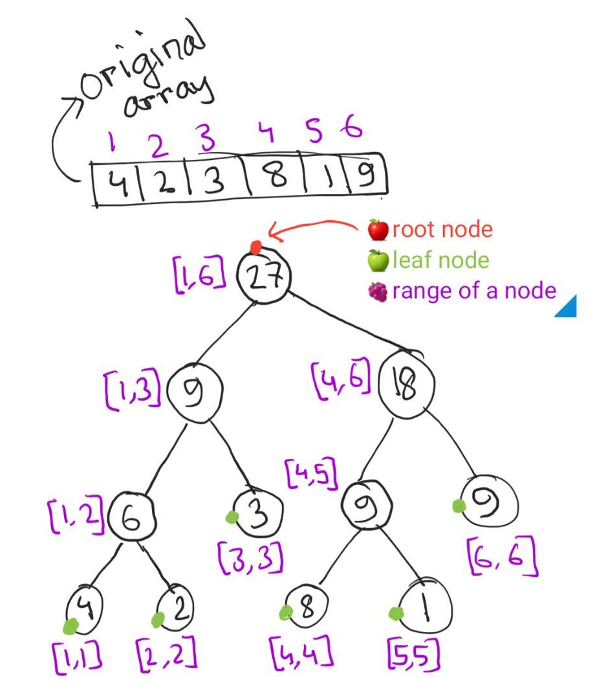
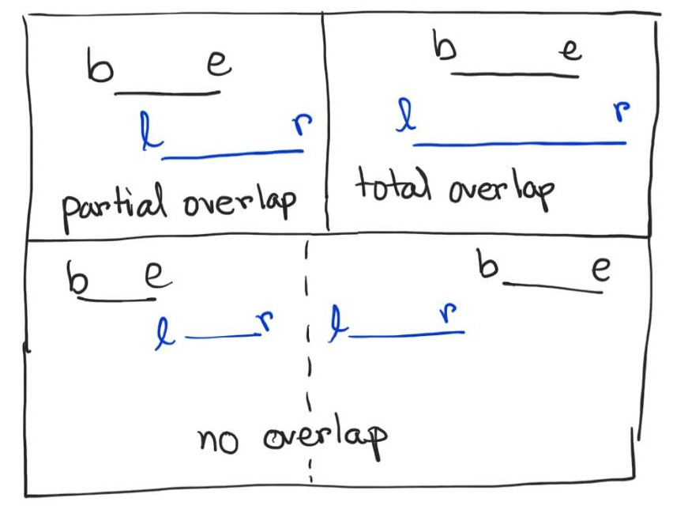

# Segment tree (সেগমেন্ট ট্রি)

ধরো অনেক গুলো নম্বর দেওয়া আছে: `4, 2, 3, 8, 1, 9`। এই নম্বর গুলো নিয়ে তোমাকে বলা হলো যে ইনডেক্স ২ থেকে ৫ এর মধ্যে সবগুলো নম্বর এর যোগফল বের করে দেখাও।

---

এটা করার একটি সহজ উপায় হচ্ছে, প্রথমে সংখ্যা গুলো একটি অ্যারে তে নিয়ে এরপর ২ থেকে শুরু করে ৫ নম্বর ইনডেক্স পর্যন্ত একটি লুপ চালিয়ে সংখ্যা গুলোর জোগফল বের করা। কিন্তু যদি তোমাকে বার বার একেক রেঞ্জের জন্য জোগফল বের করে দেখাতে বলে তখন কিন্তু এভাবে যোগফল বের করে দেখানো অনেক সময় সাপেক্ষ হয়ে যাবে। এটির টাইম কমপ্লেক্সিটি হবে O(nm) যেখানে n হলো অ্যারের সাইজ এবং m হলো কুয়েরির সংখ্যা। অর্থাৎ কুয়েরি যদি অনেক গুলো থাকে তাহলে এই পদ্ধতিটি তেমন একটা সুবিধার না।

আরেকটি উপায় আছে যেটি দিয়ে আমরা অনেক সহজে এবং প্রায় সাথে সাথে - O(1) টাইম কমপ্লেক্সিটি তে, রেঞ্জের মধ্যে জোগফল বের করে দিতে পারবো। সেটি হলো কুমুলেটিভ সাম। আমরা আরেকটি অ্যারেতে `sum[]`, প্রথম ইনডেক্স থেকে শুরু করে শেষ পর্যন্ত, প্রত্যেকটি ইনডেক্সে তার আগের ইনডেক্সের এবং ওই ইনডেক্সের যোগফল রেখে দিবো। তারপর আমরা `sum[b] - sum[a-1]` করলেই ইনডেক্স `a` থেকে `b` পর্যন্ত যোগফল পেয়ে যাবো। যোগ করার পর সাম অ্যারেটি দেখতে এরকম হবে:

    sum: [4, 6, 9, 17, 18, 27]

```cpp
int arr[5] = {4, 2, 3, 8, 1, 9};
int sum[5] = {4};
for (int i = 1; i < 5; i++) sum[i] = sum[i-1] + arr[i];
int a = 1, b = 3;
// print the sum for the range [a,b]
cout << sum[b]-sum[a-1] << endl;
```

এখন ধরো তোমাকে বলা হলো যে প্রথমে যেই নম্বর গুলো দেওয়া ছিল সেগুলো আমি কিচ্ছুক্ষন পর পর বদলে দিবো (আপডেট)। এবং তোমার নতুন চেইঞ্জ অনুযায়ী একেক রেঞ্জের সাম বের করে দেখাতে হবে। সেক্ষেত্রে যদি আপডেট অনেক কম থাকে তাহলে আমরা কুমুলেটিভ সাম টেকনিক ব্যবহার করেই কাজটি করে ফেলতে পারবো। কিন্তু উপডেট যদি অনেক বেশি থাকে তাহলে এই টেকনিক টি অনেক বেশি সময় সাপেক্ষ হয়ে দাঁড়াবে।

এসব ক্ষেত্রে আমরা নতুন একটি ডেটা স্ট্রাকচার ব্যবহার করতে পারি এবং সেটি হচ্ছে সেগমেন্ট ট্রি। সেগমেন্ট ট্রি দিয়ে অনেক অল্প সময়ের মধ্যে কুয়েরি এবং আপডেট দুই-ই করা যায় সহজেই। এটির টাইম কম্প্লেক্সিটি হলো:

    বিল্ডঃ O(n)
    আপডেটঃ O(log n)
    কুয়েরিঃ O(log n)

সেগমেন্ট ট্রি একটি ট্রি বেসড ডেটা স্ট্রাকচার। এটি মূলত ফুল বাইনারি ট্রি এর মতো যার প্রতিটা প্যারেন্ট নোডের (ম্যাক্সিমাম) দুটি করে চাইল্ড নোড থাকে। লিফ নোডে অরিজিনাল অ্যারের এলিমেন্ট গুলো থাকে আর ইন্টারনাল নোড গুলো তে লিফ নোড গুলোর মারজিং (এই ক্ষেত্রে যোগফল) থাকে। প্রতিটা নোড একটি রেঞ্জ নির্দেশ করে, রুট নোড পুরো অ্যারেটির রেঞ্জ নির্দেশ করে অর্থাৎ ইনডেক্স `1` থেকে `n` পর্যন্ত: `[1, n]` এবং লিফ নোড গুলো কেবল একটি এলিমেন্ট নির্দেশ করে যেমন `[1, 1], [4, 4]` ইত্যাদি।



আমরা যদি উপরের অ্যারেটির একটি সেগমেন্ট ট্রি কল্পনা করি তাহলে এটি দেখতে এমন হতে পারে। প্রতিটি নোডের বাম পাশে ওই নোডের রেঞ্জ দেওয়া আছে এবং আমরা খেয়াল করলেই দেখবো যে লিফ নোড গুলোতে ওই নোডের রেঞ্জের সাথে অরিজিনাল অ্যারের ইনডেক্স ম্যাচ করে ভ্যালু এসাইন করা হয়েছে। আবার রুট নোড পুরো রেঞ্জ টা নির্দেশ করছে, অর্থাৎ এই ক্ষেত্রে সব গুলো এলিমেন্ট এর যোগফল। সেগমেন্ট ট্রি এর একটা সুবিধা হলো এটার জন্য স্পেশাল কোনো ডাটা স্ট্রাকচার লাগে না। নরমাল অ্যারে দিয়েই এটি সেভ করে রাখা যায়। সেই ক্ষেত্রে আমরা প্যারেন্ট কিংবা চিলড্রেন নোড গুলো চিহ্নিত করি নিচের মতো করে:

    প্যারেন্ট: floor( (i-1)/2 )
    লেফট চাইল্ড: 2*i
    রাইট চাইল্ড: 2*i + 1

সেগমেন্ট ট্রি স্টোর করার জন্য আমাদের ভিন্ন একটি অ্যারে লাগবে যেটির সাইজ অরিজিনাল অ্যারের 4 গুন্ হতে হবেঃ [https://stackoverflow.com/a/28502243](https://stackoverflow.com/a/28502243)। তো এখন দেখা যাক সেগমেন্ট ট্রি বিল্ড করার কোড:

```cpp
#define MX 6

int arr[MX];
int tree[MX*4];

void build(int node, int b, int e) {
  if (b == e) {
    tree[node] = arr[b];
    return;
  }
  
  int left = 2*node;
  int right = 2*node + 1;
  int mid = (b + e)/2;
  
  // left child node
  build(left, b, mid);
  // right child node
  build(right, mid + 1, e);
  // merge the child nodes
  tree[node] = tree[left] + tree[right];
}
```

এটি Divide & Conquer মেথডে কাজ করে। লাইন 7 এ আমরা চেক করছি যে নোড টা কি লিফ নোড কিনা (লিফ নোড এর বাঁ পাশের রেঞ্জ এবং ডান পাশের রেঞ্জ একই: `[2, 2]`) এবং যদি লিফ নোড হয়ে থাকে তাহলে অরিজিনাল অ্যারে তে ওই ইনডেক্সে যেই ভ্যালু টা আছে ওটা ট্রি তে স্টোর করে রাখছি। তারপর লাইন 17 এবং 19 এ রিকার্সন এর মাদ্ধমে যথাক্রমে লেফট এবং রাইট চাইল্ড বিল্ড করছি। সব শেষে লাইন 21 এ আমরা দুটি চাইল্ড নোড একসাথে মার্জ করে কারেন্ট নোডে সেভ করে রাখছি।

কুয়েরি করার ক্ষেত্রে আমাদের রেঞ্জ টা: `[l, r]` বলে দিতে হবে, কোন ইনডেক্স থেকে কোন ইনডেক্স পর্যন্ত আমরা সাম পেতে চাই: `[2, 5]` অর্থাৎ দ্বিতীয় থেকে পঞ্চম ইনডেক্স পর্যন্ত সাম কি তা বের করবো। কুয়েরি করার টাইমে আমাদের তিনটি বিষয় মাথায় রাখতে হবে (এখানে `b` এবং `e` কারেন্ট নোডের রেঞ্জ):

1. **No overlap**: নোডটি যেই রেঞ্জ দেওয়া হয়েছে তার কোনো অংশেই পরে না: `b > r OR e < l`
2. **Total overlap**: নোডটি পুরোপুরি যেই রেঞ্জ দেওয়া হয়েছে সেই রেঞ্জের মধ্যে পরে: `b ≥ l AND e ≤ r`
3. **Partial overlap**: নোডটি যেই রেঞ্জ দেওয়া হয়েছে তার কিছু অংশের মধ্যে পরে এবং কিচ্ছু অংশের বাইরে পরে



```cpp
int query(int node, int b, int e, int l, int r) {
  // no overlap
  if (b > r || e < l) return 0;
  
  // total overlap
  if (b >= l && e <= r) return tree[node];
  
  // partial overlap
  int left = 2*node;
  int right = 2*node + 1;
  int mid = (b + e)/2;
  
  int p1 = query(left, b, mid, l, r);
  int p2 = query(right, mid + 1, e, l, r);
  return p1 + p2;
}
```

আপডেট ফাংশন টাও অনেকটা কুয়েরি ফাংশন এর মতোই। এবার আমরা `i` এবং `newval` পাঠাবো যেখানে `i` হলো যেই ইনডেক্সটি আপডেট করতে চাই এবং `newval` হলো যেই নতুন ভ্যালু টি দিয়ে আপডেট করা হবে। আমরা সেই নোডটি আপডেট করব যেটির `b` এবং `e` দুটোই `i` এর সাথে ম্যাচ করে অর্থাৎ সেগমেন্ট ট্রি এর যেই নোডে আমাদের `i` ইনডেক্সের ভ্যালু সেভ করা আছে।

```cpp
void update(int node, int b, int e, int i, int newval) {
  // index is out of range
  if (b > i || e < i) return;
  
  // we're at leaf node
  if (b == i && e == i) {
    tree[node] = newval;
    a[i] = newval;
    return;
  }
  
  int left = 2*node;
  int right = 2*node + 1;
  int mid = (b + e)/2;
  
  update(left, b, mid, i, newval);
  update(right, mid + 1, e, i, newval);
  tree[node] = tree[left] + tree[right];
}
```

পুরো কোড:

```cpp
// arr[] = {4, 2, 3, 8, 1, 9}
// tree[]

// build(...)
// query(...)
// update(...)

int main() {
  // 1 দিয়ে রুট নোড বুঝনো হয়েছে
  build(1, 1, MX);
  // [2, 5] রেঞ্জ কুয়েরি করবো
  cout << query(1, 1, MX, 2, 5) << endl;
  // 3 নম্বর ইন্ডেক্সটি আপডেট করে 10 সেট করবো
  update(1, 1, MX, 3, 10);
  cout << query(1, 1, MX, 2, 5) << endl;
  return 0;
}
```

> NEXT: [Segment tree 2 lazy propagation (সেগমেন্ট ট্রি লেজি প্রোপাগেশন)](posts/ds/segment-tree-lazy-propagation.md)
