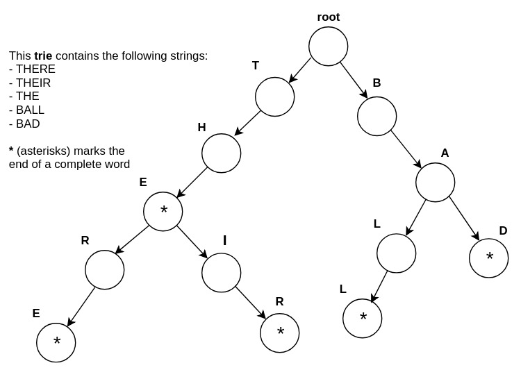

# Trie
Trie is an efficient data structure for working with strings. Trie excels in searching strings. If you have lots of strings with size n (let's just assume every string has the same length for simplicity), searching for a string can take a lot of time if we do a brute force search (searching for one string of length n in another string takes O(n^2) time in the worst case, so searching many strings will obviously take way more time). But, in case of trie, we can do pre-processing (storing) in linear time. Then searching for a string of length m will take only O(m) time! (i.e time required to **only** traverse the string we need to search) That's a serious improvement. Think of it, even if you have hundreds of thousands of words to search for, if you want to search the word 'HELLO', it'll only take O(5) time!

```
n = length of all strings combined
m = length of the string we want to search
Insertion: O(n)
Searching: O(m)
```

Its a tree data structure, in the sense that, this data structure stores all the individual characters of a string as separate nodes (or vertices) in a tree. There is a root node from which all other nodes descend. See the following figure:



We have 5 different strings stored in the trie: THERE, THEIR, THE, BAD, BALL.

### How does it (insertion) work?
Let's say we want to store the word THERE (↓ down arrow represents a pointer in the tree, which points to the node we're currently processing):

```
    1. Find the root node. Point to it (↓).
       ↓
       root
    2. Is T a child of root? No. Insert T as child of root and move the pointer(↓) to it.
              ↓
       root → T
    3. Is H a child of root? No. Insert H as child of T and move the pointer(↓) to it.
                  ↓
       root → T → H
    4. keep inserting in a similar way till the last character.
                          ↓
       root → T → H → E → R
    5. Is E a child of root? No. Insert E as child of R and move the pointer(↓) to it.
                              ↓
       root → T → H → E → R → E
       Since this is the last letter of the word, so we also insert a mark(*) to indicate that this node represents the end of an word.
                              ↓
       root → T → H → E → R → E(*)
```

What if we want to insert the word THEIR?
```
    1. Find the root node. Point to it (↓).
       ↓
       root
    2. Is T a child of root? Yes. Move the pointer(↓) to T.
              ↓
       root → T
    3. Is H a child of T? Yes. Move the pointer(↓) to H.
                  ↓
       root → T → H
    4. Is E a child of H? Yes. Move the pointer(↓) to E.
                          ↓
       root → T → H → E → R
    5. Is I a child of E? No, insert it as child E and move the pointer(↓) to it.
                          ↓
       root → T → H → E → I
    6. Is R a child of I? No, insert it as child of I and move the pointer(↓) to it.
                              ↓
       root → T → H → E → I → R
       Since R is the last character of the string, we mark(*) it in the trie.
                              ↓
       root → T → H → E → I → R(*)
```

### Searching
Searching for a string is similar to inserting. Instead of inserting new nodes, we just traverse down the matching nodes. If a character of the given string doesn't match, we conclude that it isn't present in the trie. Also, even if all characters match, if the last matched node is not marked as an _end of word_, we conclude that it isn't present in the trie.


```python
# -----------------------------------------------
# The structure will look like this
#            root
#            ↙  ↘
#           A    B
#          ↙      ↘
#       ...       ...
# -----------------------------------------------
# root = {
#     'A': {
#         'is_end_of_word': True/False
#     },
#     'B': {
#         'is_end_of_word': True/False
#     },
#     ...
# }

root = {} # the root node

def insert(string):
    # p is the pointer pointing to the current node
    p = root
    for idx, c in enumerate(string):
        if c not in p:
            # no node for character 'c' exists,
            # make a new node for 'c'
            node = {'is_end_of_word': False}
            
            # store the node in the tree as a child of p
            # note! p points to the current node being processed
            p[c] = node
        
        # we point to the new/existing node
        p = p[c]
        
        # if it's the last character of the string, mark it as a word
        p['is_end_of_word'] = True if idx == len(string)-1 else False


insert('HELLO')
insert('HELL')
insert('HI')
insert('HAND')

# import pprint
# pp = pprint.PrettyPrinter()
# pp.pprint(root)

# print '\n'
# print '-'*80
# print '\n'

# return True if string is present, False otherwise
def search(string):
    # if string is empty, return False
    if not string: return False
    
    p = root
    for c in string:
        if c not in p:
            return False

        p = p[c]

    return p['is_end_of_word']

print search('HELLO')
print search('HE')      # HE was not inserted into the trie
print search('HEL')     # HEL was not inserted into the trie
print search('HELL')
print search('')
```

    True
    False
    False
    True
    False

